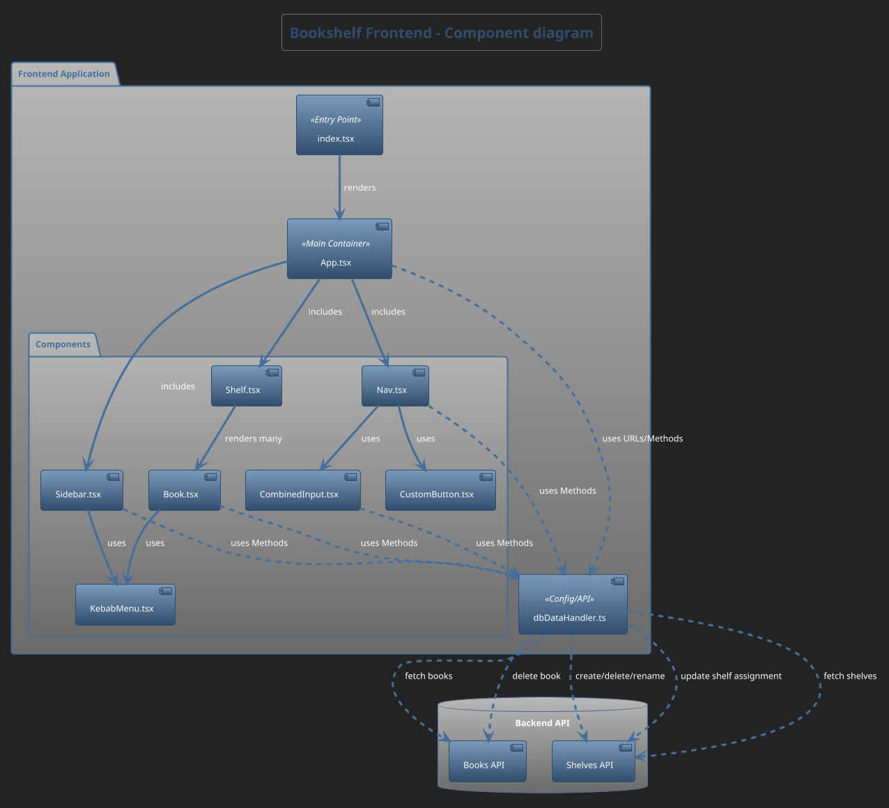

# Bookshelf Application

## Stack
- Node + Express backend
- React frontend
- TypeScript (front- and backend)
- MariaDB
- Docker

## Project structure
- monorepo with workspaces
- backend in `backend` folder
- frontend in `frontend` folder
- schema and seed data for the database in `db` folder
- everything available in Docker with docker-compose

## Docker
- database, backend and frontend are all available in Docker
- database is only available in a Docker container
- backend and frontend are available in separate containers or as local processes
- `npm run docker:stack` will build and run everything as container

## Getting started
- clone repository
- requirements:
    - Node.js 24.13.0 (tested)
    - npm 11.6.4 (tested)
    - Docker Desktop 4.63.0 (tested)
    - Docker Compose 5.0.2 (tested)
- `npm install` in root folder

*More commands down below*
### .env
| Variable           | Description                    | Optional | Default value | Notes                                                                                            |
|--------------------|--------------------------------|----------|---------------|--------------------------------------------------------------------------------------------------|
| `PORT`             | Port for backend               | Yes      | 5500          |                                                                                                  |
| `CORS_ORIGIN`      | CORS origin for backend access | Yes      | * (Wildcard)  |                                                                                                  |
| `API_KEY`          | API key for Google Books API   | Yes      | **None**      | Not necessary, but recommended for high number of requests                                       |
| `DB_HOST`          | host of database               | Yes      | 127.0.0.1     | Necessary when application is run in docker container. Leave empty if you are running it locally |
| `MARIADB_USER`     | username for database access   | No       | **None**      | Required for DB connection                                                                       |
| `MARIADB_PASSWORD` | password for database access   | No       | **None**      | Required for DB connection                                                                       |
| `MARIADB_DATABASE` | name of database               | No       | **None**      | Required for DB connection                                                                       |
| `host`             | host of backend server         | Yes      | **None**      | Only required for the use of Test.http, backend/configured in http-client.env.json               |
| `port`             | port of backend server         | Yes      | **None**      | Only required for the use of Test.http, backend/configured in http-client.env.json               |

## Commands
### Development
Start a database container and run frontend and backend locally.

For development, I also recommend using DBeaver, phpmyadmin or a similar tool to check the database directly.

`npm run docker:db`

`npm run dev`

### Stop Containers
Stop and remove all containers.

`npm run docker:down`

### Reset Database
Recreate database including schema and seed data.

`npm run docker:db:reset`

**Checkout `package.json` for more commands**

## Testing
`backend/Test.http` contains API requests for testing. Most require seed data

## Documentation
### Backend
Check out `http://localhost:5500/swagger-docs` for swagger API documentation

*Requires swagger to be generated and backend to be running*

### Frontend
**Component diagram**
To view the rendered diagram, open `frontend/docs/frontend_component_diagram.svg` or copy and paste the following code into [PlantUML](https://plantuml.com/):
